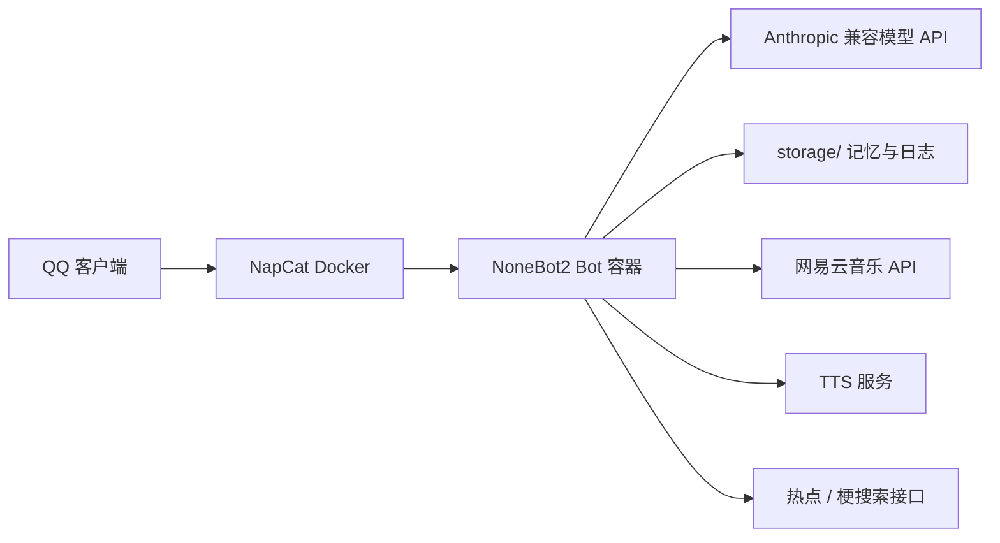

# 开源部署指南

这份文档面向第一次接触本项目的部署者，目标是让你从零把机器人跑起来。

## 部署结构



最小可运行链路只有三部分：

1. `NapCat`
2. `bot` 容器
3. 一个可用的 LLM API

其余都是可选能力。

## 部署前准备

| 项目 | 说明 |
|------|------|
| Docker Desktop / Docker Engine | 需要能正常执行 `docker compose` |
| QQ 小号 | 用于 NapCat 登录 |
| LLM API | 兼容 Anthropic 的接口地址、Key、模型名 |
| Windows 可选 | 如果要用 GPT-SoVITS，本地宿主机更方便 |
| 音乐模块可选 | 需要一个 `NeteaseCloudMusicApi` 兼容服务 |

## 首次部署

### 1. 复制配置文件

```bash
cp .env.example .env
cp config.example.toml config.toml
```

Windows 下可以直接用资源管理器复制，或者运行仓库内的一键脚本：

```bat
start_bot_with_tts.bat
```

### 2. 填 `.env`

最少检查这几个字段：

| 字段 | 作用 |
|------|------|
| `SUPERUSERS` | 管理员 QQ 号，必须是 JSON 数组 |
| `ONEBOT_WS_URLS` | NapCat WebSocket 地址，默认即可 |
| `LLM_BASE_URL` / `LLM_API_KEY` / `LLM_MODEL` | 可选，覆盖 `config.toml` 里的 LLM 配置 |
| `NETEASE_MUSIC_API_URL` | 可选，覆盖网易云 API 地址 |

如果 NapCat 和 Bot 都在 Docker 里，通常不用改 `ONEBOT_WS_URLS`。

### 3. 填 `config.toml`

最少要确认这些块：

| Section | 必填项 | 说明 |
|---------|--------|------|
| `[llm]` | `base_url`, `api_key`, `model` | 模型接入 |
| `[admins]` | `"QQ号" = "昵称"` | 群管理工具授权 |
| `[music]` | `enabled`, `api_base_url` | 网易云音乐卡片 / 登录 |
| `[tts]` | `enabled`, `provider` | 语音发送 |
| `[sticker]` | `enabled`, `send_probability` | 表情包能力 |
| `[meme]` | `enabled`, `hotboard_url` | 热榜与网络梗 |

默认配置已经能跑主流程，但开源给别人时，建议把这些开关说明清楚。

### 4. 启动服务

```bash
docker compose up -d --build
```

如果你在 Linux 上想走仓库内的发布脚本，可以用：

```bash
./scripts/deploy.sh
```

这个脚本会构建 bot 镜像、打版本标签，然后启动容器。

### 5. 登录 NapCat

打开 NapCat WebUI：

```text
http://127.0.0.1:6099
```

完成 QQ 登录后，查看容器状态：

```bash
docker compose ps
```

## 常用可选模块

### 网易云音乐

需要一个 `NeteaseCloudMusicApi` 兼容服务，默认端口是 `3000`。

```toml
[music]
enabled = true
api_base_url = "http://127.0.0.1:3000"
cookie_file = "storage/netease_cookie.json"
```

如果音乐 API 跑在宿主机而 bot 在 Docker 中，`api_base_url` 用 `http://host.docker.internal:3000`。

### 语音

两种方式：

| 方式 | 特点 |
|------|------|
| `edge` | 不需要额外服务，但依赖外网 TTS 能力 |
| `gpt_sovits` | 需要你本地启动 GPT-SoVITS API，适合自定义音色 |

GPT-SoVITS 模式下，bot 通过 `http://host.docker.internal:9880` 访问宿主机 API。

### 热梗 / 热搜

`meme` 模块会定时拉取热点，并给模型提供梗搜索能力。它依赖外网可访问的热榜接口和普通网页搜索能力。

## 端口参考

| 服务 | 默认端口 | 说明 |
|------|----------|------|
| NapCat WebUI | `6099` | 账号登录与管理 |
| NapCat HTTP API | `29300` | bot 与 NapCat 通信 |
| NapCat WS | `29301` | 本地开发调试 |
| Bot HTTP 服务 | `8080` | NoneBot / FastAPI |
| 网易云 API | `3000` | 可选 |
| GPT-SoVITS API | `9880` | 可选 |

## 常见问题

### 1. Docker 起不来

先确认 Docker Desktop 已启动，再执行：

```bash
docker version
docker compose ps
```

### 2. 登录后机器人没反应

依次检查：

1. `SUPERUSERS` 是否正确
2. `config.toml` 的 `[llm]` 是否填了真实 API
3. `allowed_groups` / `allowed_private_users` 是否把消息挡住了
4. 看 `storage/logs/` 下的 bot 日志

### 3. 语音不发

检查：

1. `[tts].enabled = true`
2. `provider` 是否和实际服务一致
3. GPT-SoVITS API 是否能访问
4. `ref_audio_path` 是否是宿主机上的真实绝对路径

### 4. 音乐卡片不发

检查：

1. `music.enabled = true`
2. `api_base_url` 是否能访问
3. 管理员是否已私聊执行登录流程

### 5. NapCat 登录失效

不要直接 `down` 再 `up` NapCat。优先用：

```bash
docker compose restart napcat
```

## 推荐的开源说明方式

如果你准备公开仓库，建议在 README 里只保留：

1. 项目简介
2. 最短启动步骤
3. 链接到这份部署指南
4. 链接到运维手册

这样首页不会太长，真正部署的人也不会迷路。
